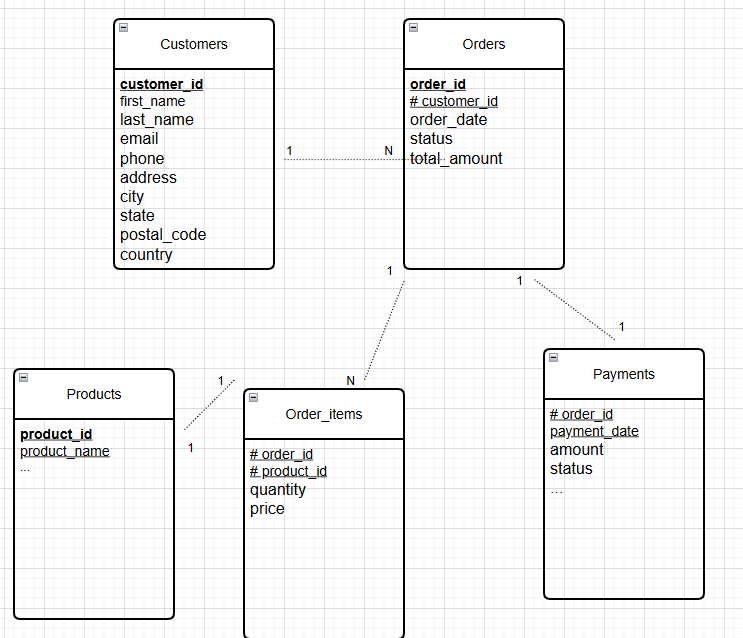
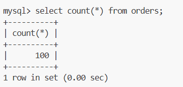
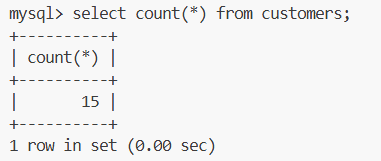
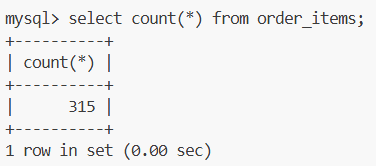
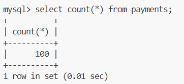
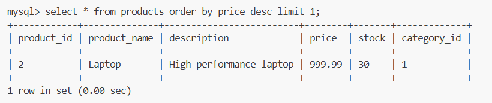
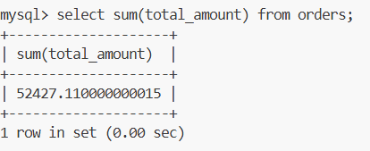

## Entity Relationshipp

This schema represents ....

## Queries

- Row Numbers

- The most expensive product.

- Total revenue from all orders.

- The customer who has placed the most orders.

select customer_id, count(order_id) from customers join orders group by order_id limit 1;